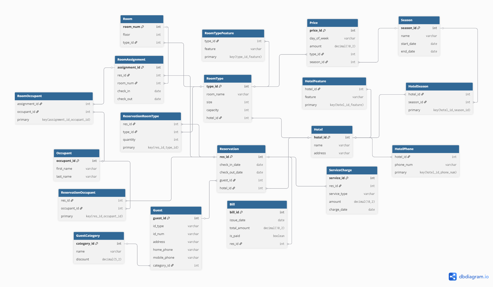

# CS374 Hotel Database Final Report
Matthew Murphy

## ER Model

---

## Relational Model

- Conference Review System: 
- madiSTEM System: 
- madiSTEM System (dbdiagram style): 
- ER-to-Relational Mapping: 

---

## Database creation

- Drop tables: [drop_fk.sql](./database/drop_fk.sql)
- Create tables: [create.sql](./database/create.sql)
- Add constraints to tables: [add_fk.sql](./database/add_fk.sql)

---

## Data

- Load generated fake data: [load_data.sql](./data/load_data.sql)

---

## Queries

### Query 1
- [Query 1](./queries/query1.sql)
- [Results](./data/q1.csv)

This query finds all room types available at Hotel A between July 15–17. It checks availability by comparing total rooms to already reserved rooms during those dates. It also calculates the average nightly price based on the season, day of the week, and guest discount.

---

### Query 2
- [Query 2](./queries/query2.sql)
- [Results](./data/q2.csv)

This query finds all unoccupied rooms. It excludes rooms that are already assigned during the given time period.

---

### Query 3
- [Query 3](./queries/query3.sql)
- [Results](./data/q3.csv)

This query generates a bill for a reservation. It includes the room cost adjusted by day of the week and guest discount, and any extra service charges to calculate the final total.

---

### Query 4
- [Query 4](./queries/query4.sql)
- [Results](./data/q4.csv)

This query lists the people in the reservation.

---

### Query 5
- [Query 5](./queries/query5.sql)
- [Results](./data/q5.csv)

This query calculates the total amount a guest spent over a one-year period by summing all bills associated with their reservations.
