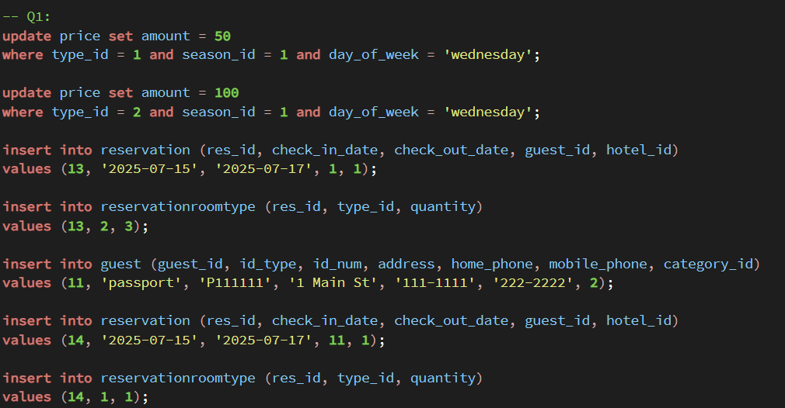
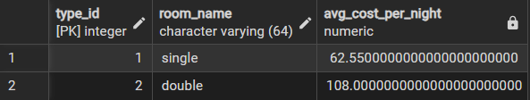
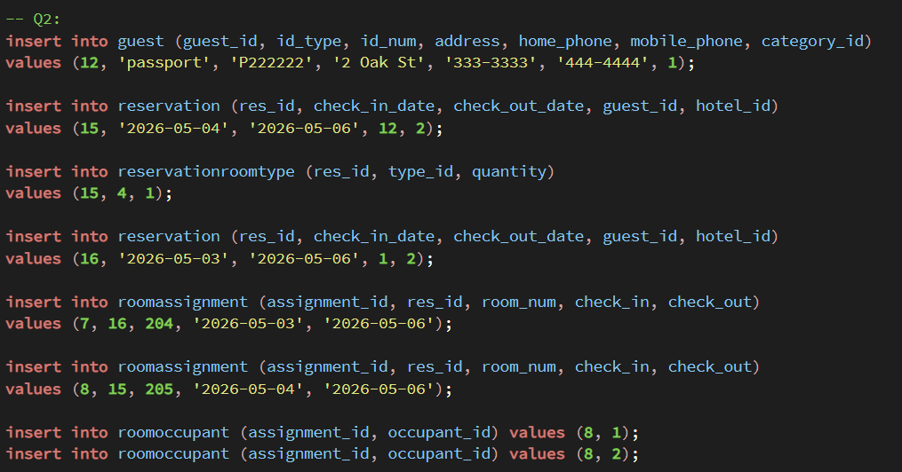
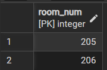
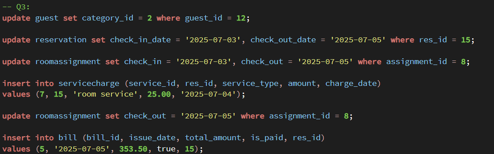
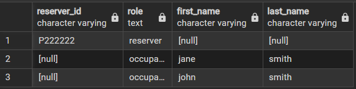
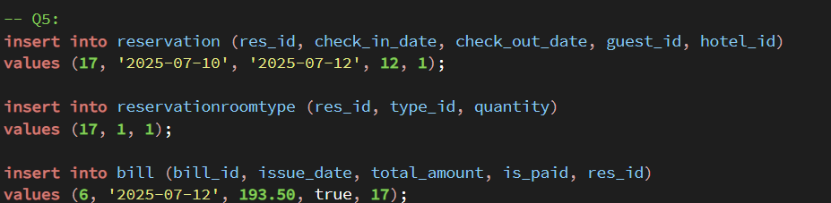
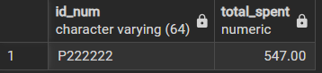

# CS374 Hotel Database Final Report
Matthew Murphy

## ER Model
*insert the image here*

*describe any changes since HW7*

## Relational Model
*insert the image(s) here*

- Conference Review System: 
- madiSTEM System: 
- madiSTEM System (dbdiagram style): 

*Describe any changes since HW7*

## Database creation
*Link the files here*

- Drop tables: [drop_fk.sql](./drop_fk.sql)
- Create tables: [create.sql](./create.sql)
- Add constraints to tables: [add_fk.sql](./add_fk.sql)

*They should be in a subdirectory called database*

*Describe any changes very briefly: for example:*

We changed the scripts to match updated model shown in previous section.

## Data
*Link the files here*

- Load generated fake data: [load_data.sql](./load_data.sql)

*They should be in a subdirectory called data*

*Describe any changes very briefly: for example:*

We changed the data to facilitate the queries, as described in the following sections.  We also changed how we loaded the data for X, Y and Z to using insert statements rather than `faker`.

## Queries

### Query 1
- [Query 1](./query1.sql)
- [Results](./q1.csv)

**Setup**

**Results**

This query finds all room types available at Hotel A between July 15–17. It checks availability by comparing total rooms to already reserved rooms during those dates. It also calculates the average nightly price based on the season, day of the week, and guest discount.

---

### Query 2
- [Query 2](./query2.sql)
- [Results](./q2.csv)

**Setup**

**Results**

This query finds all unoccupied rooms. It excludes rooms that are already assigned during the given time period.

---

### Query 3
- [Query 3](./query3.sql)
- [Results](./q3.csv)

**Setup**

**Results**

This query generates a bill for a reservation. It includes the room cost adjusted by day of the week and guest discount, and any extra service charges,\ to calculate the final total.

---

### Query 4
- [Query 4](./query4.sql)
- [Results](./q4.csv)

**Results**

This query lists the people in the reservaton.

---

### Query 5
- [Query 5](./query5.sql)
- [Results](./q5.csv)

**Setup**

**Results**

This query calculates the total amount a guest spent over a one-year period by summing all bills associated with their reservations.

