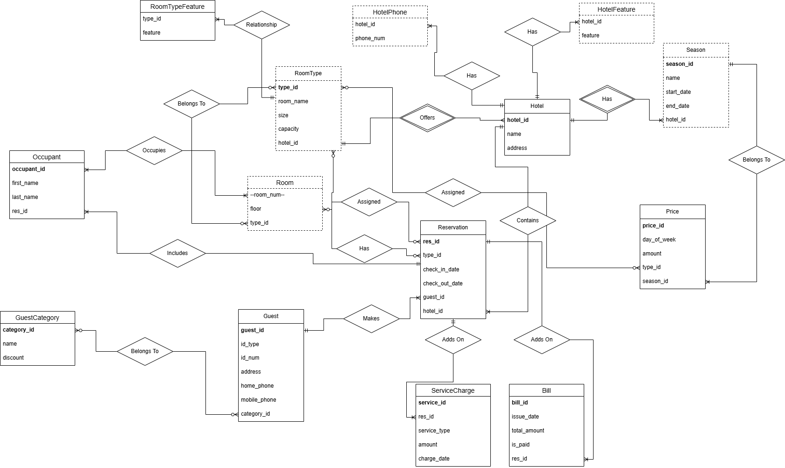
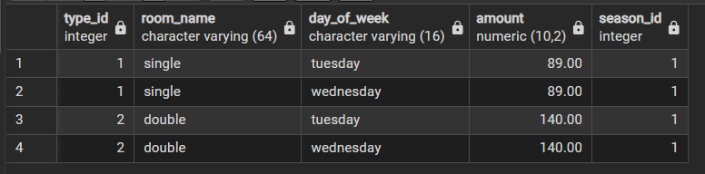
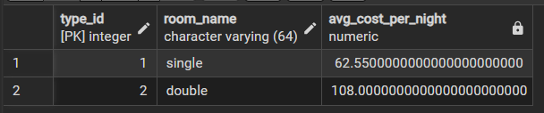
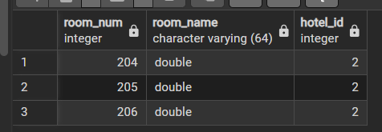
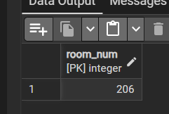
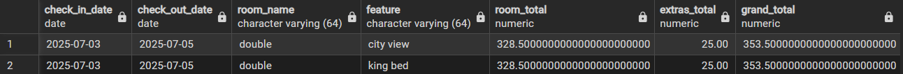

# CS374 Hotel Database Final Report
Matthew Murphy, Jousha Golden

## ER Model

---

## Relational Model

- ER-to-Relational Mapping: 

Changes Made:
- Changed "Spa Charge" to "ServiceCharge"
- Added HotelPhone, HotelFeature, and RoomTypeFeature
- Added extra foreign keys and changed tables to make relational mapping more consistent with ER Model

---

## Database creation

- Drop tables: [drop_fk.sql](./database/drop_fk.sql)
- Create tables: [create.sql](./database/create.sql)
- Add constraints to tables: [add_fk.sql](./database/add_fk.sql)

---

## Indexes

- **idx_room_type_id**: Speeds up room type lookups in Query 1 for finding available rooms.
- **idx_price_type_season_day**: Composite index for fast price lookups by type, season, and day of week in Queries 1 and 3.
- **idx_reservation_hotel_dates**: Enables fast date-range queries on reservations by hotel in Query 1.
- **idx_reservationroomtype_type_res**: Supports efficient lookup of reserved quantities in Query 1.
- **idx_roomassignment_room_dates**: Composite index for occupancy date-range queries in Query 2.
- **idx_roomassignment_res**: Speeds up room assignment lookups by reservation in Queries 3 and 4.
- **idx_servicecharge_res**: Fast service charge lookups by reservation ID in Query 3.

---

## View

- **v_room_occupancy**: Simplifies room occupancy checks in Query 2 by normalizing check-out dates.

---

## Data

- Load generated fake data: [load_data.sql](./data/load_data.sql)

---

## Queries

### Query 1
- [Query 1](./queries/query1.sql)
- [Results](./data/q1.csv)

Before running, prices are the same on Tuesday and Wednesday and no reservations block July 15–17.

The script adjusts Wednesday prices to differ from Tuesday, fills all double rooms with a reservation, then books a single room for the new Gold guest.

The result shows only the single room type with an average nightly price reflecting the 10% Gold discount. The double is excluded because all 3 rooms are now reserved.

---

### Query 2
- [Query 2](./queries/query2.sql)
- [Results](./data/q2.csv)

Before running, Mrs. Smith already has a reservation at Hotel B (res_id 15), and all 3 double rooms (204, 205, 206) are unoccupied.

The script finds those available double rooms, checks in Mr. Smith as a new occupant, assigns room 204 to him, and puts both Smiths in room 205 under Mrs. Smith's reservation.

After check-in, only room 206 remains unoccupied — rooms 204 and 205 are now taken.

---

### Query 3
- [Query 3](./queries/query3.sql)
- [Results](./data/q3.csv)

This query generates a bill for a reservation. It includes the room cost adjusted by day of the week and guest discount, and any extra service charges to calculate the final total.

---

### Query 4
- [Query 4](./queries/query4.sql)
- [Results](./data/q4.csv)

This query lists the people in the reservation.

---

### Query 5
- [Query 5](./queries/query5.sql)
- [Results](./data/q5.csv)

This query calculates the total amount a guest spent over a one-year period by summing all bills associated with their reservations.
